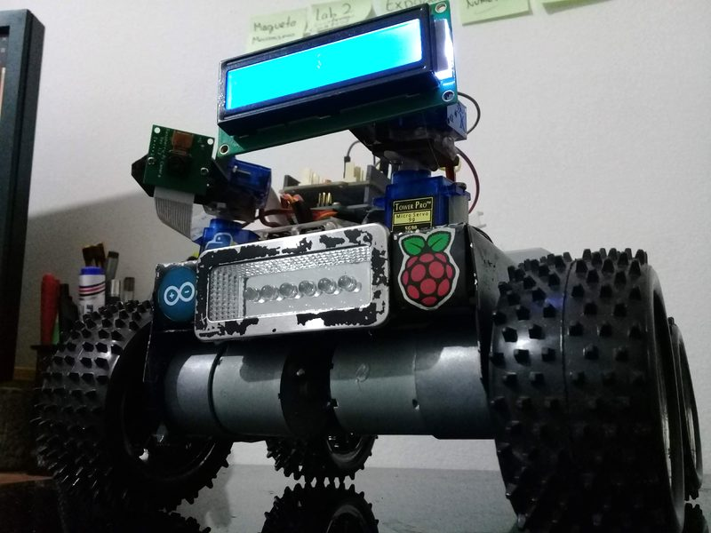
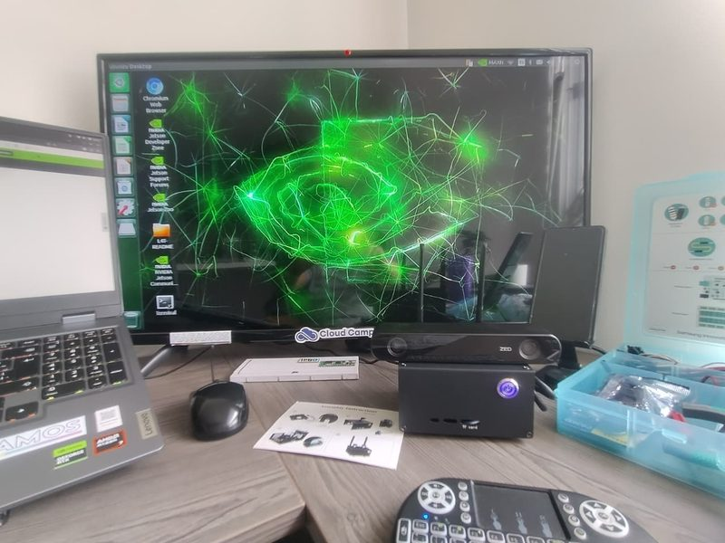
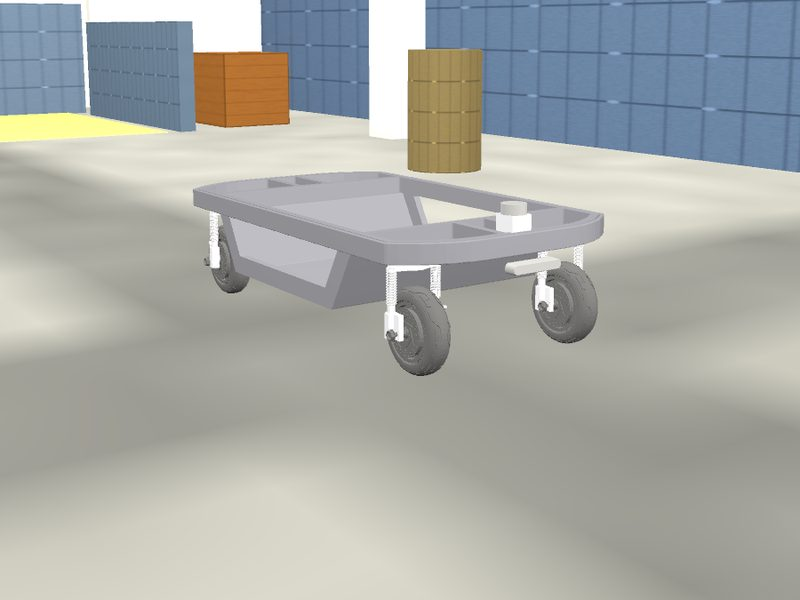
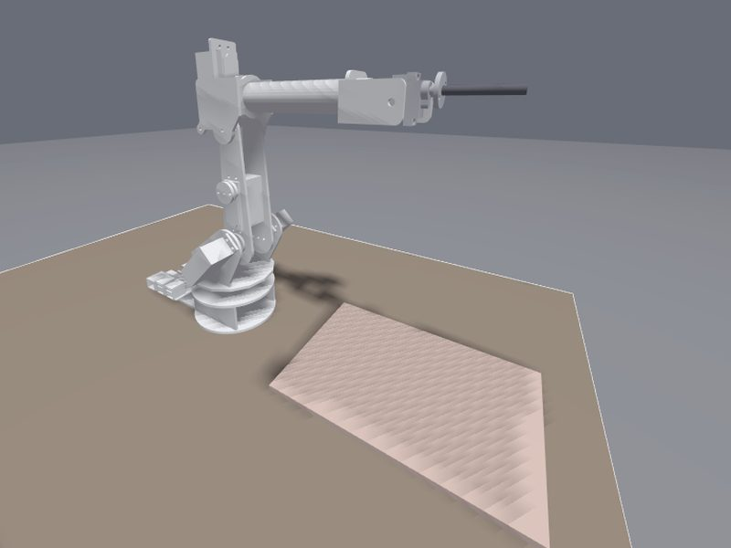
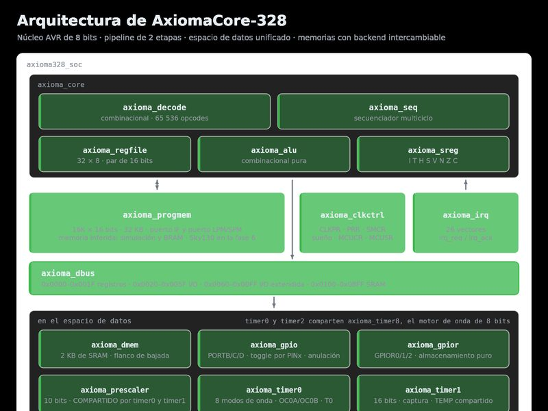
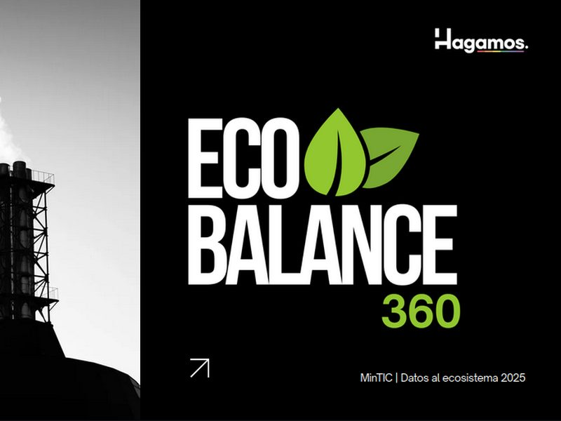

  

  <h3>Full Stack Developer · Microservices & APIs · Autonomous Robotics</h3>

  

  

---

## About

Industrial Automation Engineer and Full Stack Developer from Bogotá, Colombia. For five years I've been building enterprise software: microservices, APIs and web applications designed to scale, stay available and be easy to maintain.

Outside of work, I build robots. Mobile platforms and robotic arms with ROS 2, taken from simulation to real hardware, plus a bit of electronics along the way.

**What I work on**

- Enterprise web applications and microservices, from architecture to deployment
- Autonomous robots with ROS 2: SLAM, navigation, kinematics and computer vision
- Digital chip design in Verilog, electronics and embedded systems
- Open source and educational technology with [Semillero Robótica Utadeo](https://github.com/TadeoRoboticsGroup)

🔭 **Currently:** adding visual SLAM to Axioma with a ZED 2i and RTAB-Map 
💬 **Ask me about:** ROS 2, SLAM, microservices, .NET, React 
☕ **Fuel:** coffee, lots of it

 

---

## Tech Stack

<table>
  <tr>
    <td align="right"><b>Backend</b></td>
    <td>
      
      
      
      
      
      
      
      
      
      
      
    </td>
  </tr>
  <tr>
    <td align="right"><b>Frontend</b></td>
    <td>
      
      
      
      
      
      
      
    </td>
  </tr>
  <tr>
    <td align="right"><b>Databases</b></td>
    <td>
      
      
      
    </td>
  </tr>
  <tr>
    <td align="right"><b>DevOps & Tools</b></td>
    <td>
      
      
      
      
      
      
      
      
      
      
      
    </td>
  </tr>
  <tr>
    <td align="right"><b>Robotics & Hardware</b></td>
    <td>
      
      
      
      
      
      
      
    </td>
  </tr>
  <tr>
    <td align="right"><b>AI, Vision & Data</b></td>
    <td>
      
      
      
      
      
      
    </td>
  </tr>
</table>

---

## Featured Projects

<table>
  <tr>
    <td width="50%" valign="top">
      

      <h3>🤖 <a href="https://github.com/MrDavidAlv/Axioma_robot">Axioma Robot</a></h3>
      
<em>Autonomous mobile robot for industrial logistics</em>

      
4WD skid-steer robot running SLAM Toolbox, AMCL and Nav2. Its SLAM map scores 99.8/100 against the real floor plan in Gazebo, and it is now getting RGB-D visual SLAM with a ZED 2i.

      
<code>ROS 2 Humble</code> <code>Nav2</code> <code>SLAM Toolbox</code> <code>Gazebo</code> <code>C++</code> <code>Python</code>

    </td>
    <td width="50%" valign="top">
      

      <h3>👁️ <a href="https://github.com/MrDavidAlv/ZED2i_vSLAM">ZED 2i Visual SLAM</a></h3>
      
<em>Camera-only perception on a Jetson Nano</em>

      
Visual SLAM with a single stereo camera: no wheel encoders, no LiDAR, no GNSS. On a 49 m loop, RTAB-Map's loop closure brought the drift down from 1.06 m to 6 mm.

      
<code>ROS 2 Humble</code> <code>RTAB-Map</code> <code>ZED SDK</code> <code>Jetson Nano</code> <code>Docker</code>

    </td>
  </tr>
  <tr>
    <td width="50%" valign="top">
      

      <h3>🚗 <a href="https://github.com/MrDavidAlv/tadeo-eCar-ws">Tadeo eCar 4WD4WS</a></h3>
      
<em>Autonomous university logistics robot</em>

      
Omnidirectional electric robot for indoor logistics at Universidad Jorge Tadeo Lozano, with three steering modes (Ackermann, omnidirectional, crab), Nav2, real-time SLAM and LiDAR perception.

      
<code>ROS 2 Humble</code> <code>Nav2</code> <code>ros2_control</code> <code>Gazebo</code> <code>OpenCV</code>

    </td>
    <td width="50%" valign="top">
      

      <h3>🦾 <a href="https://github.com/MrDavidAlv/TATTOTRONIX">TATTOTRONIX</a></h3>
      
<em>5-DOF desktop manipulator</em>

      
A small robotic arm built to hold a tattoo pen. It turns an image into a toolpath, solves the inverse kinematics and draws it in Gazebo, backed by a full kinematic and dynamic model.

      
<code>ROS 2 Humble</code> <code>ros2_control</code> <code>Gazebo</code> <code>Python</code> <code>Docker</code>

    </td>
  </tr>
  <tr>
    <td width="50%" valign="top">
      

      <h3>⚙️ <a href="https://github.com/TadeoRoboticsGroup/AxiomaCore-328">AxiomaCore-328</a></h3>
      
<em>Open-source 8-bit microcontroller in Verilog</em>

      
Binary-compatible with the ATmega328P and designed entirely with open-source tools. Every block is verified against independent oracles, and it synthesizes and meets timing on a Lattice ECP5 FPGA. Sky130 tape-out is on the roadmap.

      
<code>Verilog</code> <code>RTL Design</code> <code>FPGA</code> <code>Sky130</code> <code>Open-source EDA</code>

    </td>
    <td width="50%" valign="top">
      

      <h3>🌱 <a href="https://github.com/ColectivoHagamos/EcoBalance360-Mapa-Nacional-de-Captura-y-Emisiones-de-Carbono">EcoBalance360</a></h3>
      
<em>National carbon capture and emissions map</em>

      
Interactive geospatial platform to map and analyze carbon balance across Colombia, with AI-assisted analysis. Built with <a href="https://colectivohagamos.com">Colectivo Hagamos</a>.

      
<code>Python</code> <code>Next.js</code> <code>GeoJSON</code> <code>Data Visualization</code>

    </td>
  </tr>
</table>

---

## 🎵 Coding Soundtrack

  
  

---

## Contact

&nbsp;

&nbsp;

---

Thanks for stopping by. Always happy to talk about software, robots or chips.

© 2026 Mario David Alvarez Vallejo · Bogotá, Colombia

