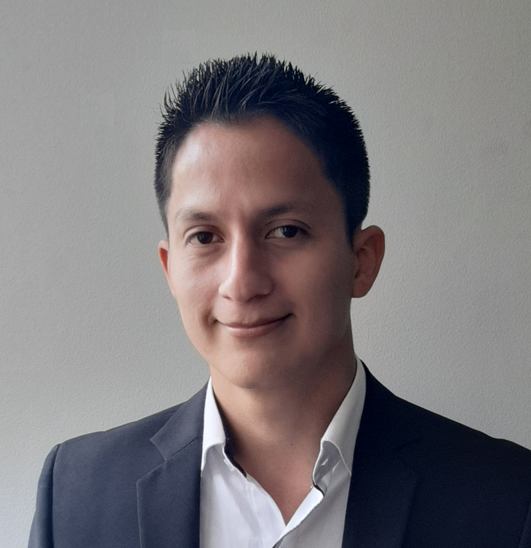

.. figure:: https://readme-typing-svg.herokuapp.com?font=Architects+Daughter&color=%2338C2FF&size=50&center=true&vCenter=true&height=60&width=600&lines=Hey!+I'm+MrDavidAlv;Welcome+to+my+profile! 
  :alt: welcome to my profile

Hi, I'm Mario Alvarez (💻💖☕) 

.. figure:: https://readme-typing-svg.herokuapp.com?font=comfortaa&color=016EEA&size=24&width=500&lines=FullStack+Developer;Autonomous+robot+creator
  :alt: skills

Industrial automation engineer, fullstack developer, robotics enthusiast and open source promoter, mobile robotics and autonomous robots researcher and technopreneur from the Colombia 💻💖☕

- 💝 Web application developer
- 💼 Creator of multiple mobile robots
- 💼 Developer and creator of electronic circuits
- 👨‍🔬 Entucuasta and promoter of community work
- 💞 Member of the Latam Robots community
- 🔏 currently i like to learn javascript, python and go
- ☕ Coffee lover, turning it into code, `you can buy me a coffee <https://buymeacoff.ee/mrdavidalv>`__!
- 🎯 I like JS frameworks (React⚛ , Vue, Next)
- 💡 `Learn more about me <https://bio.link/mrdavidalv>`__.

🤗💪🤓🌱
I have knowledge in web development👨‍💻, 3d modeling🧿, robotics🤖, electronics⚡ and systems💻 
passionate about topics related to 	autonomous driving cars🏎, space exploration🚀, robotics🦾, astronomy🔭, artificial intelligence👾, 💡engineering⚙️ and 🔬science in general🧬

My social networks `Linkedin <https://www.linkedin.com/in/mrdavidalv>`__, 🌐 `Facebook <https://www.facebook.com/mrdavidalv>`__, 🐦 `Twitter <https://www.twitter.com/mrdavidalv>`__ and 📷 `Instagram <https://www.instagram.com/mrdavidalv>`__

.. figure::  https://github-readme-stats.vercel.app/api/top-langs/?username=mrdavidalv&layout=compact&show_icon=true&theme=algolia&hide_border=true
  :height: 200
  :align: center
.. figure::  https://github-readme-stats.vercel.app/api/?username=mrdavidalv&layout=compact&show_icon=true&theme=algolia&hide_border=true
  :height: 200
  :align: center
.. figure::  https://user-images.githubusercontent.com/44630882/173249286-02d3dd8e-f6da-482b-831e-b138352ecab2.svg#gh-ligth-mode-only&theme=algolia&background=0d1117&hide_border=true
  :height: 200
  :align: center

🎵 programmer music  
--------------------

.. figure:: https://media.giphy.com/media/M9gbBd9nbDrOTu1Mqx/giphy.gif
  :width: 90
  :align: center
  :target: https://musicforprogramming.net/one

  https://musicforprogramming.net/one

## 🍀 Sponsors and Supporters

.. figure:: https://img.shields.io/badge/Buymeacoffee-%23FFDD00.svg?&style=for-the-badge&logo=buy-me-a-coffee&logoColor=black
  :align: center
    
  and **you**... `buy me coffee <https://bmc.xyz/mrdavidalv>`__ if you love what I do!
	
.. figure:: https://camo.githubusercontent.com/ae7fa19af398148214678af687add062f479b1130e467634b21ac855719c29b6/68747470733a2f2f6769746875622d70726f66696c652d74726f7068792e76657263656c2e6170702f3f757365726e616d653d6d726461766964616c762677696474683d25323235253232266865696768743d25323235253232
  :height: 100
  :align: center

  😍 Thanks for watching my profile! Have a nice day! 😉

  Copyright 2022, Mario David Alvarez Vallejo 

.. figure:: https://upload.wikimedia.org/wikipedia/commons/thumb/a/ae/Github-desktop-logo-symbol.svg/1024px-Github-desktop-logo-symbol.svg.png
  :height: 26
  :align: center
  :target: https://profile-summary-for-github.herokuapp.com/user/mrdavidalv
  